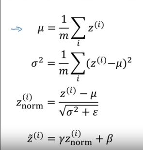
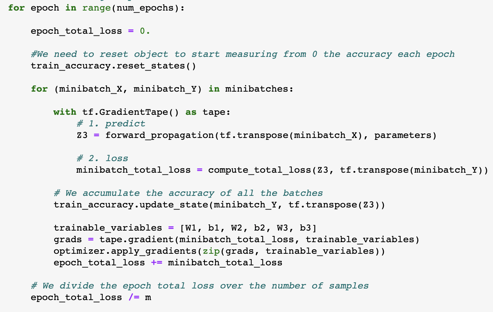

# Course 2: 

# Week 3: Tuning & Tensorflow
## Hyperparam Search
### Hyperparm Importance
In decreasing order of importance
1. Learning rate α 
2. Momentum β (~0.9), # of hidden units, mini batch size
3. Num. of Layers, learning rate decay
4. With Adam, tuning params not worth it. β1 ~ 0.9, β2 ~ 0.999 and ε 10e-8 

:star: # units > layers :star:
:question: Where does dropout fall in this list ?

### How to Search ?
1. `Grid Search`: Good for few hyperparams. Waste on larger scale as some hyperparam changes are not worth it (like ε).
2. `Random Search / Coarse to Fine`: Works efficiently to find regions that work well. Zoom into those and continue search.  

:thought_balloon: Grid search was wisdom 5 years ago at CMU! :thought_balloon:

### Appropriate scale for Hyperparams
:star: # units > Sampling at random `!=` Sampling **uniformly** at random. `=>` Pick scale correctly :star:
1. In some cases sampling randomly will do the job (`for layer in [2,3,4]`)
2. In some case range is so big that sampling randomly will favor some subregions over others.

:star: Search `α in range [10e-4, 1]`. Transform to `log` scale and then search randomly. :star:

3. Exponentially weighted averages:
   1. β = 0.9 is averaging over last 10 gradients. β = 0.999 is last 1K gradients. 
   2. So flip it to `1 - β in [0.1, 0.001]` and do the `log` transformation
   3. Eg: `0.9 -> 0.9005` is `~ 10 iterations` (from $num_iter = \frac{1}{1 - \beta}$). But `0.999 -> 0.9995` changes from `1K -> 2K` prev gradients.

:star:Searching in `log` and not `linear` scale will improve odds you land on range where β sensitivity is high (`0.999 -> 0.9995`)  :star:

### Intuitions are not frequently transferable
- Re-evaluate hyperparms every few months. 
- `Caviar Approach` : If you can train multiple models in parallel. 
- `Panda Approach`: Train 1 model at a time, trying out changes in hyperparams if needed. 
-----------------
## Batch Normalization
- Normalize linear sum `z` across neurons in a layer. 
- Helps make contours more spherical. 
- Might not want the `z` in a layer to have `mean = 0 and var = 1` (ReLU). So:
```math
z^{(i)} = γ^{(i)} * z^{(i)}_{norm} + β^{(i)} 
```

- The `γ` and `β` are params updated like W and b (mini-batch gradient descent). 
- `β` is not same as momentum hyperparam. 

:star: Since the above $z^{(i)}$ formula has a bias component, ignore bias `b` in the unnormalized weighted sum. :star:

- :star: Intuitions:
  - Make deeper layers more responsive to earlier layers.
  - If earlier layer activations change (covariate / distribution shift in input data), then outputs of later 
  layers impacted. They haven't seen this data before. Normalizing ensures activations always in expected distribution. 
  - Each mini batch's linear sum is scaled by the mean/variance computed ONLY ON THAT MINI BATCH! (Not across whole
  training set. So there is some slight regularizing noise added to the $z^{i}$ values like dropout.) 

:star: Use Batch Norm to better learn covariate shifts. Regularization is just unintended side-effect that goes down
with increase in mini-batch size:star:

During test time:
- Samples are sent 1 at a time (and not mini batches).
- So how to calculate mean and variance on 1 example ?
- `Option 1`: Pass whole training set through **final** network once and calculate mean and variance for every layer.
- `Option 2` (more common): Keep track of exponentially weighted moving average of mean and variance for every mini bqtch during training.

## Tensorflow
- `tf.Variable`: For weights and biases whose values keep changing
- `tf.Constant`: For input dataset
- `tape.gradient` function: allows you to retrieve the operations recorded for automatic differentiation inside the 
GradientTape block. Then, calling the optimizer method `apply_gradients`, will apply the optimizer's update rules to 
each trainable parameter.
