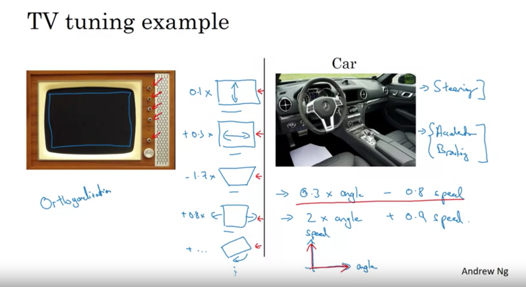
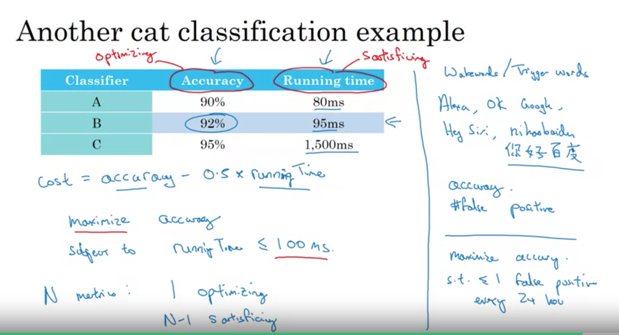
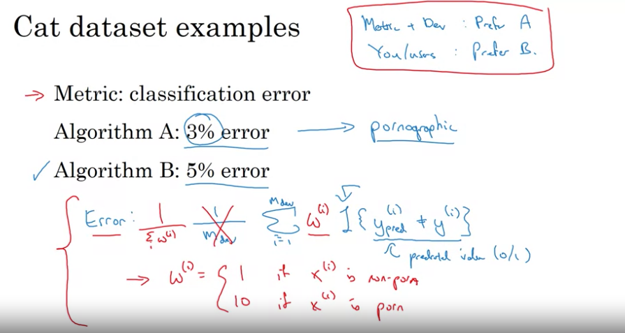

# Course 3: Structuring ML Projects
#### :star: Best ML engineers know which specific knob to tune to achieve specific effect Y :star:
-  Things you don't learn in any other course ! Takes years of real world experience

## Theme of ML Strategy
### Orthogonalization
- Process of turning 1 specific knob to tune 1 aspect of performance. Fine grained control. 
- Not orthogonal = 1 knob to tune multiple parameters. Eg: One button on TV that controls image width, height, slanting
based on this eqn:
- `Early stopping` Ng doesn't use: It's not orthogonalized. It reduce training fit *as well as* dev fit.



## Setting Up Your Goal
:star: Make iterations faster. Automate ! :star:

### Single Number Metric
- `F1 Score` better than using 2 metrics `Precision` and `Recall`. Coz if one model has better precision but other has
better recall, which one do you choose ? Go with better `F1 score` (harmonic mean of the 2)
- Use `average` error across classes. 
- Help :star: quick iteration !:star:


## Optimizing and Satisficing Metric
- If average is not meaningful (like find best model using accuracy and runtime), use this. 
- When there are `N` metrics you want to tune, choose `1` to optimize and the other `N-1` can become `satisficing` i.e.
the performance is subject to some threshold.
- Maximize `accuracy` subject to `runtime <= 100ms`. Easier to pick best performing model. 
- Satisficing = Satisfy + Sacrifice


## Setting up Dev & Test Sets
- No point if dev and test sets are in different distributions. Because `months` of optimizing on dev set + metric will
perform poorly on test set. 
- Randomly shuffle data to ensure dev and test sets have same distribution. 
- Choose dev and test to :
  - reflect future data and 
  - cover important cases that you want to do well on. 

## Dev & Test Set Sizes
- Old Era 
  - Total dataset size < `10K`. So train, dev, test split ~ `60%, 20%, 20%`
  - Lots of folks would only use train-test ~ `70-30` but use test and dev set (use test to make hyperparameter decisions)
- Today:
  - Big data ~ `1M` samples. 
  - So train, dev, test ~ `98%,1%,1%`. You don't need more than `10k` samples for dev and test. 

## When to change dev/test sets and metrics ?
### Incorrect Metric
```
Algos for classification of cat images. 
Algo A: 3 % error but shows porno images. 
Algo B: 5 % error but doesn't classify any cat images as porn. 
```
- So choose a better evaluation metric that penalizes porn images. 


### Incorrect Dev/Test Sets.
- Dev/test set has clear cat images. But users upload blurry images. 
:star: **Don't overthink. Choose. Build. Iterate. Fast** :star:

## Comparing with Human-level Performance