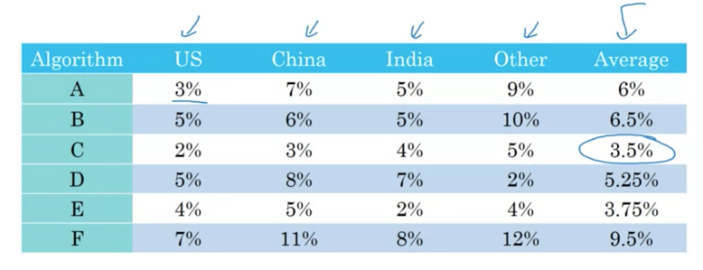
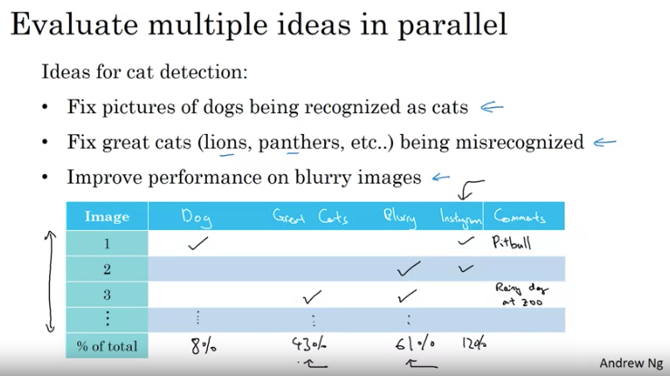
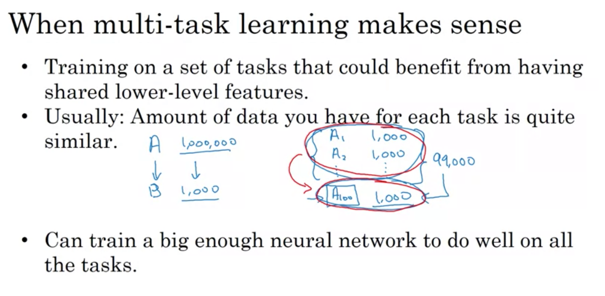

# Course 3: Structuring ML Projects
#### :star: Best ML engineers know which specific knob to tune to achieve specific effect Y :star:
-  Things you don't learn in any other course ! Takes years of real world experience

## I. Theme of ML Strategy
### Orthogonalization
- Process of turning 1 specific knob to tune 1 aspect of performance. Fine grained control. 
- Not orthogonal = 1 knob to tune multiple parameters. Eg: One button on TV that controls image width, height, slanting
based on this eqn:
- `Early stopping` Ng doesn't use: It's not orthogonalized. It reduce training fit *as well as* dev fit.


## II. Setting Up Your Goal
:star: Make iterations faster. Automate ! :star:

### 1. Single Number Metric
- `F1 Score` better than using 2 metrics `Precision` and `Recall`. Coz if one model has better precision but other has
better recall, which one do you choose ? Go with better `F1 score` (harmonic mean of the 2)
- Use `average` error across classes. 
- Helps quick iteration ! 



### 2. Optimizing and Satisficing Metric
- If average is not meaningful (like find best model using accuracy and runtime), use this. 
- When there are `N` metrics you want to tune, choose `1` to optimize and the other `N-1` can become `satisficing` i.e.
the performance is subject to some threshold.
- Maximize `accuracy` subject to `runtime <= 100ms`. Easier to pick best performing model. 
- Satisficing = Satisfy + Sacrifice


### 3. Setting up Dev & Test Sets
- No point if dev and test sets are in different distributions. Because `months` of optimizing on dev set + metric will
perform poorly on test set. 
- Randomly shuffle data to ensure dev and test sets have same distribution. 
- Choose dev and test to :
  - reflect future data and 
  - cover important cases that you want to do well on. 

### 4. Dev & Test Set Sizes
- Old Era 
  - Total dataset size < `10K`. So train, dev, test split ~ `60%, 20%, 20%`
  - Lots of folks would only use train-test ~ `70-30` but use test and dev set (use test to make hyperparameter decisions)
- Today:
  - Big data ~ `1M` samples. 
  - So train, dev, test ~ `98%,1%,1%`. You don't need more than `10k` samples for dev and test. 

### 5. When to change dev/test sets and metrics ?
#### Incorrect Metric
```
Algos for classification of cat images. 
Algo A: 3 % error but shows porno images. 
Algo B: 5 % error but doesn't classify any cat images as porn. 
```
- So choose a better evaluation metric that penalizes porn images. 


#### Incorrect Dev/Test Sets.
- Dev/test set has clear cat images. But users upload blurry images. 
:star: **Don't overthink. Choose. Build. Iterate. Fast** :star:

## III. Comparing with Human-level Performance
### 1. Why ?

- To know how much improvement is possible AND what tools to use to improve. 
- `Bayes Irreducible Error`: Too much noise in labels. Humans can't do well on this either. 
- `Before reaching HLP` : Use tools to improve that are *harder* to use after surpassing HLP. 
  - *Get more labeled data from humans*: To train model better
  - *Manual Error Analysis*: See why a human got this right and model wrong. Give model more of incorrect samples.
  - *Bias/Variance Analysis*: Harder to do after crossing HLP. More later. 
- `After reaching HLP`: If humans are close to matching Bayes Irreducible Error, then surpassing HLP may not leave lots 
of room for improvement. 

### 2. Avoidable Bias
- HLP may or may not be close to Irreducible Bayes Error. But HLP error a *proxy* for Bayes error.
- `Avoidable Bias` = Diff between training error and Bayes error. You can reduce by training more, bigger neural network etc. 
- If training error is close to HLP, then focus on reducing `Variance`i.e. brining dev error closer to training error. 
Regularization, getting more training data etc. 

:star: You *can't* get lower training error than Bayes' error unless you **overfit** :star:


- In some fields HLP error ~ `0%` (like cat recognition from images). But in other fields (like transcription from
audio recording where speech is not clear), it's non 0. :star: Define HLP !!! tells you where to put effort. :star:

### 3. Surpassing HLP
- Places where ML surpasses HLP:
  - Online Advertising
  - Product Recommendations
  - Loan Approval
  - Logistics (predict transit time)
- Interestingly all are :
  - `structured data`. :star: **Not natural perception problems!** :star:
    - Humans tend to be better at natural perception problems. But recently in some cases ML has surpassed. Medical
    tasks (radiology)


## IV. Error Analysis
Top 2 takeaways:
- Build first model quickly. Iterate. 
- :star: Spend a few hours of boring *manual effort* to find and prioritize the *biggest sources* of error to solve. :star:

### Manual Inspection
- `Tackle Biggest Problem First`: Look at all misclassified instances. Find which images (%) make up most errors. Few hours well spent. 
- `Evaluate multiple ideas in parallel`. 
  - Some images maybe misclassified because they're blurry *and* from instagram. Check which sub-case has most issues. 
  

### Cleaning Up Incorrectly Labeled Data
- `Are Some Labels Consistently Noisy ?`: Did turks *systematically* label white dogs as cats ? DL not robust to this. 
It is robust to random errors. 
- Do same as above. Check if systematic incorrect labels is a *big enough fish* to fry. 

- If it's a big enough problem, apply label correction to both dev and test sets. :star: They should have same dist! :star:

## V. Mismatched Training & Dev/Test Set
### How to handle few instances of target class.
Eg: Train has : images of cats from web pages (`200K`). We care about images from mobile app. (`10K`)
- *Don't* mix train + dev/test, shuffle and split. 
  - This ensures all 3 sets have same distribution. 
  - But very few instances of images from mobile app in training. So features from mobile app images not well learnt. 
- *Do*: 
  - Ensure distribution of dev/test is what you're interested in (mobile app images only!)
  - Only as many dev/test needed to get reasonable measure of bias variance (`~2.5K` each)
  - Add all remaining (`5K`) back to training. 

### :star: Bias/Variance on Mismatched Training & Dev/Test sets :star:

- Keep aside a portion of train set: a `train-dev-set` , that has same distribution as train but *not* used to train. 
  - `Why ?`: If `train` and `dev` sets have **different** distributions then you *can't* necessarily attribute high dev error
  to overfitting on train set. Maybe model generalizes well but dev set has images that are *hard* to classify.  
  - If train and dev have *same* distribution, and dev error is high, you can say overfitting to train set and not
  generalizing well. (`Variance` problem)
  - Orthogonalize the problem with train-dev set.  

- More general formulation:


Questions:
- *Can dev/test error ever be lower than train error ?*
  - Yes. If the data in dev/test is *easier* to classify. 

### How to solve Data Mismatch ?
- Manual Error Analysis. Look at differences between train and dev sets. *Don't look at test set!!*. No decision should
be made on model and training based on info from test set. That's why we have dev set. 
- Make training set closer to dev set. How ?
  - `Artificial Data Synthesis/ Data Augmentation`: 
    - Ng says he's seen this *significantly* improve performance in speech
    recognition. 
    - :star: Caution: You might *oversample* a tiny space of all possible datapoints. 

## VI. Learning from Multiple Tasks
### Transfer Learning


### Multi-task Learning

- Build a single neural network that solves multiple classifications. In 1 image predict if it has pedestrian, car, crosswalk, stop sign. 
- Prediction will be `(4, m)` matrix. 
- Objective will be `Logistic Loss` over 4 classes per data point. 
- Training set does *not* need to have all 4 labels for each data point. 
  - In this case, loss will skip summation over labels that are *missing* for a training sample. 
- Better than building 4 different neural networks when:


:star: If you have big enough NN MTL almost always outperforms single NN. 
- Object detection in CV is most common use case of MTL. 
- It's rare to want to detect so many other labels in a single datapoint outside this. 

Transfer learning used more often in practice. If you have a small dataset think of this :star:


## VII. End To End Deep Learning