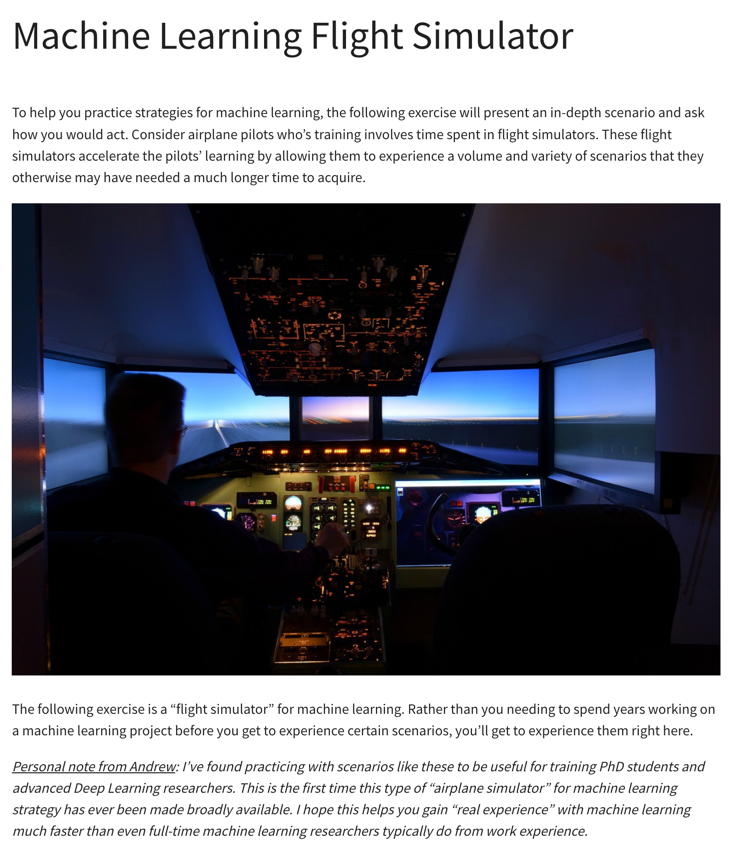
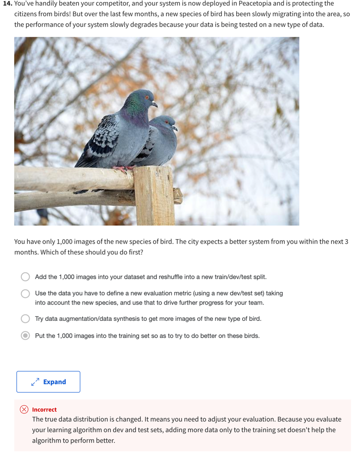

# ML Flight Simulator
PRecious stuff !!

:star: Years of ML experience in a few hours :star:


## Gotchas
### The only distributions that should match are DEV and TEST !
:star::star::star::star::star::star::star::star::star::star::star::star::star::star::star::star::star:
Adding training data that differs from the dev set may still help the model improve performance on the dev set. 
Only 2 points matter with test set:
- the dev and test set have the same distribution.
- test set's distribution should match cases that you care about. 
Else you're not aiming where you want to hit.
:star::star::star::star::star::star::star::star::star::star::star::star::star::star::star::star::star:

### True Distribution Changes ! 
If you have only `1k` data points of a minority class (in a dataset with `1M+`), *don't* :
- immediately shuffle and split across train/dev/test (*use data rationally!*) NOR
- Add *all* to training set only. *True distribution has changed*, so evaluating on a dev-test set that don't contain 
new bird type won't help.


DO :
- Create a new evaluation metric (using new dev/test) taking into account change in true distribution *using data you have*. 
and *then* : 
- Augment minority dataset. 
### How big should dev-test datasets be ?
Only as big as necessary to evaluate bias, variance. Add rest to training set to learn better. So on 1M+ dataset:
```
95,2.5,2.5
98,1,1
```

### What if I have extra data that's different from the distribution we expect in production ?
- Use it to train *only*. :star: Training set distribution DOES NOT need to be same as test/dev. 
- `Test` distribution should match what you care about and what you might see in production. 
- `Dev` distribution should match test else you won't be aiming where you want to hit. 