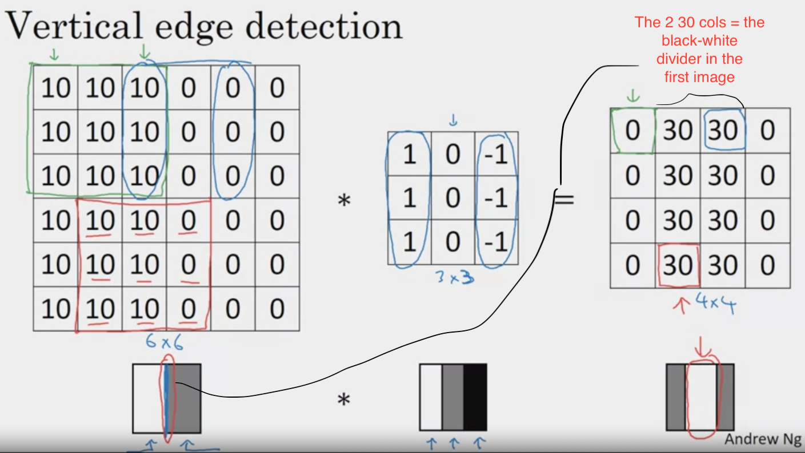
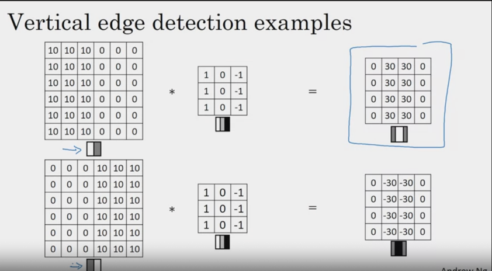

# Course 4: Convolutional Neural Networks

## I. Basics
- Convolution
- Edge Detection
- Padding
- Strides
### Convolution
- `filter` = `kernel`.
- Convolution = Element wise product (`*`) between sub-matrix of a matrix and filter.
- The kernel value determines what kind of object it's detecting. 
- `(r,c) image * (x,y) filter = (r-x+1, c-y+1) convolved image`
### Edge Detection

- Higher values = brighter pixels.
- The detected edge is thicker in the convolved image than original since image is small. 
In bigger images with more pixels, the thickness will line up. 
- 1s in first col and -1 in third col of filter =>
  - Bright convolved edge = transition from light to dark.
  - Dark convolved edgfe = transition from dark to light.
  
  ```
  Note: If you don't care about transition => Use absolute value of convolved image.
  ```
### Padding
- Purpose: 
  - To give more weight to information in edge, corner pixels that are otherwise convolved once. Central pixels part of many 
  more convolutions. 
  - Convolution reduces image size. So you can convolve only so many times until it's `1x1`. Adding padding allows convolved image to have 
  same dimension as original image => more convolutions possibles => More features detectable. 
  - 
### Valid & Same Convolutions
- *Valid*: 
  - `(nxn) * (fxf) = (n-f+1,n-f+1)` (Size reduction)
  - No padding
- *Same*: 
  - `(n+2p x n+2p) * (fxf) = (n+2p-f+1,n+2p-f+1)`
  - To ensure same size as original:
    - `n+2p-f+1 = n`

```math
a = \frac{a+b}{c}
```