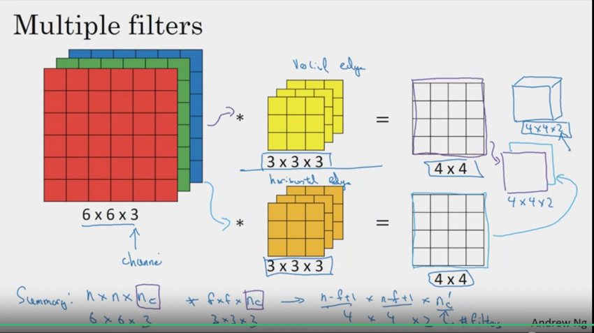
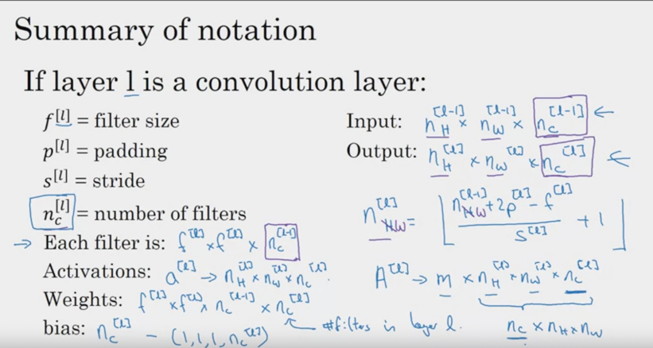
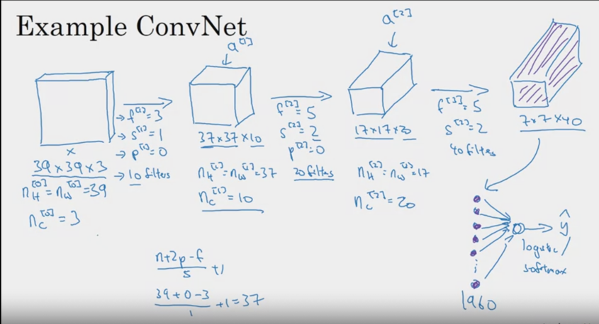
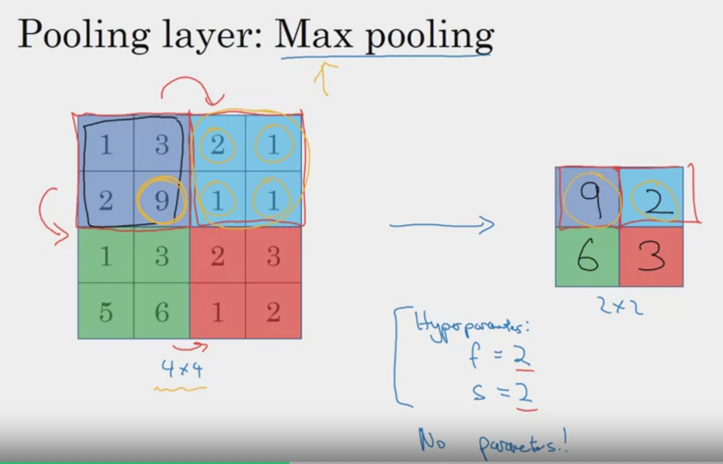

# Course 4: Convolutional Neural Networks

## I. Basics
- Convolution
- Edge Detection
- Padding
- Strides
- Convolving over volumes

### Convolution
- `filter` = `kernel`.
- Convolution = Element wise product (`*`) between sub-matrix of a matrix and filter.
- The kernel value determines what kind of object it's detecting. 
- `(r,c) image * (x,y) filter = (r-x+1, c-y+1) convolved image`
### Edge Detection

- Higher values = brighter pixels.
- The detected edge is thicker in the convolved image than original since image is small. 
In bigger images with more pixels, the thickness will line up. 
- 1s in first col and -1 in third col of filter =>
  - Bright convolved edge = transition from light to dark.
  - Dark convolved edgfe = transition from dark to light.
  
  ```
  Note: If you don't care about transition => Use absolute value of convolved image.
  ```
### Padding
- Purpose: 
  - To give more weight to information in edge, corner pixels that are otherwise convolved once. Central pixels part of many 
  more convolutions. 
  - Convolution reduces image size. So you can convolve only so many times until it's `1x1`. Adding padding allows convolved image to have 
  same dimension as original image => more convolutions possibles => More features detectable. 
  - 
#### Valid & Same Convolutions
- *Valid*: 
  - `(nxn) * (fxf) = (n-f+1,n-f+1)` (Size reduction)
  - No padding
- *Same*: 
  - `(n+2p x n+2p) * (fxf) = (n+2p-f+1,n+2p-f+1)`
  - To ensure same size as original:
    - `n+2p-f+1 = n`
    - So padding to ensure same dim as original image: 
```math
p = \frac{f-1}{2}
```
:star: *Why are odd sized `f` values most common ?* :star:
- So that padding (`p`) on either side is a whole number!
- Kernel has a central pixel. Helpful to talk about position of filter. 

### Strides
- Instead of moving filter, one pixel hori/vertically, take `s` jumps. 
- *My Guess* (:star:): Regularizing effect potentially ? Since you're reducing contribution of each pixel towards feature detection.
```math
\lfloor \frac{n+2p-f}{s} + 1  \rfloor
```

### Convolving over volumes
 
 
- Each filter *set* has `n_c` channels. Same as image. 
- 1 convolution of 1 filter set with image yields *1 number*!
- Multiple filters (read filter set) per layer can extract multiple features per layer. 

```math
n x n x n_c * f x f x n_c = (n -f + 1) x (n -f + 1) x n_c1
```
- n_c1 = number of filter sets per layer. 

:star: *Reason why params in CV remain small even if images are big* :star:
- Only small number of filters needed (10) to detect all sorts of features.  
- With 10 filters, each of size `3x3x3` with 1 bias, you'd only needed `28 * 10 = 280` params. 


## II. Notation
 
 
## III. Observations of hyperparam trends
across a deep CNN. 
 
From start to end layer:
- Channels increase
- H and W of images decrease.

## IV. Pooling
- Same formula as conv layers. Usually with `s=2 and f = 2`
- :star: Difference!: Applies on each channel! There's only 1 max pool filter that applies to each channel. `n_c=1` 
- Since there are no hyperparams to learn, makes backprop easy!
- Inutition: Max pool finds most prominent feature in each subregion. 

 
- Usually reduces image size by half (`s=2 and f=2`)