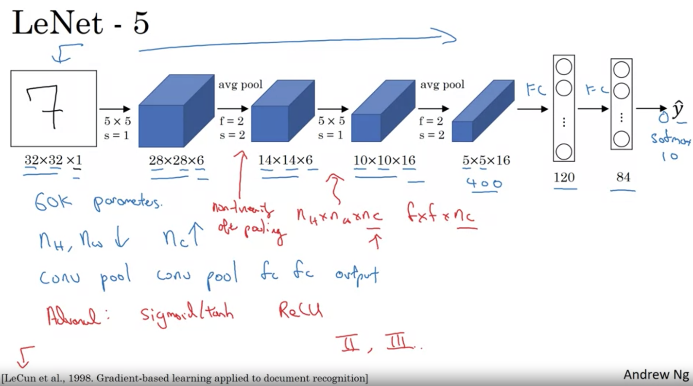
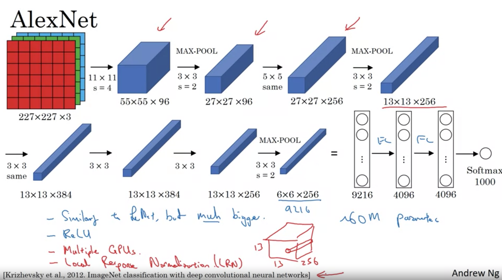
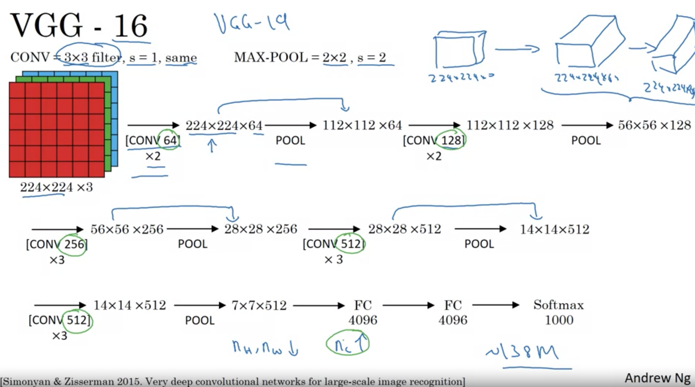
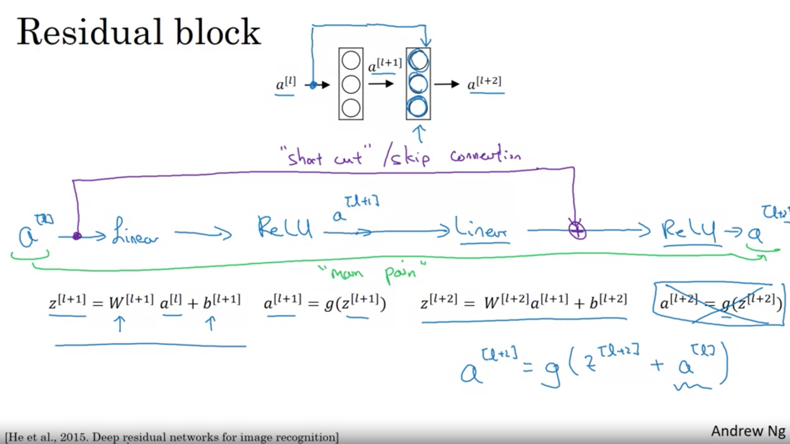
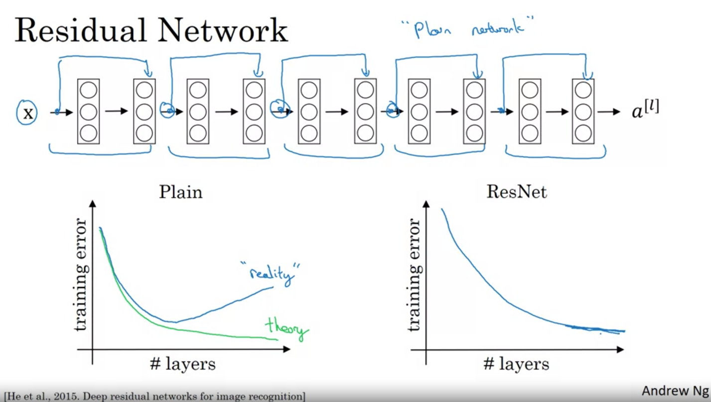
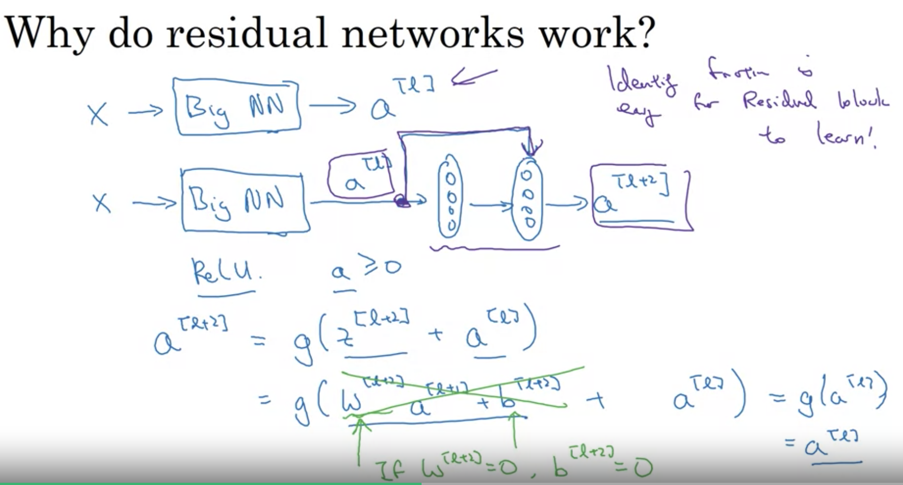
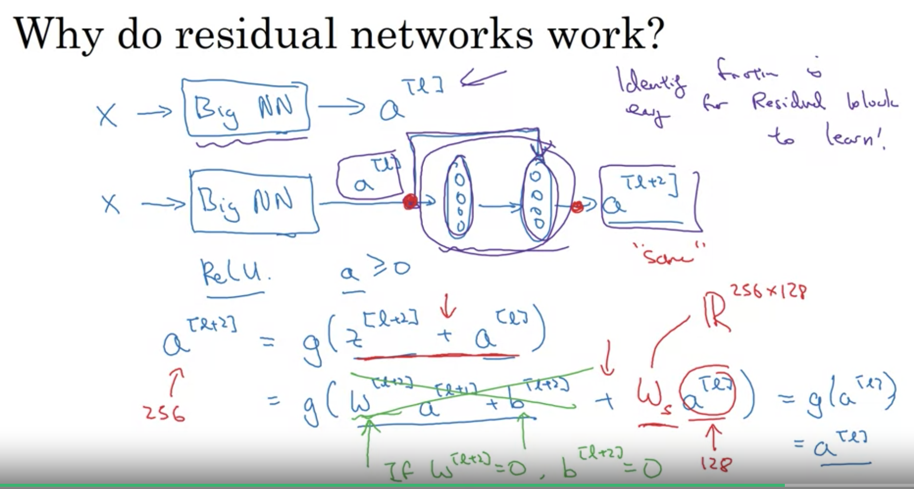

# Course 4: Convolutional Neural Networks (Week 2: Case Studies)
:star: Always learn from other case studies. Don't re-invent the wheel ! :star:
------------------------
## I. Classic Networks
### LeNet 5 (1998)
- Greyscale digit 
- Avg pooling with `s=2`. Max pool more common today 
- No padding. Valid convolutions. `s=1`. Sigmoid and tanh more common than ReLU at the time. 
- Channels # (`1->6 -> 16`)
- Softmax not used at output. Something else. 
- Small (`64K`). Today `10-100M` params. 
- Common: `conv->pool->conv->pool->fc->fc->output`

Not common today but in this:
- Nonlinearity after pooling (sigmoid)
- Filters don't have `n_c` channel each. Rather different filters for *each* channel. 

  

### AlexNet (2012)
- `60M` params (1000X size of LeNet)
- Deeper network
- ReLU act. 
- GPUs were slower at the time. 
- This paper convinced CV community that Deep Learning works for CV. 
- :star: Easier paper to read. :star:
- `Local Response Normalization (LRN)`:
  - Normalize activations across *all* (256) channels of a specific (`h,w`) in output volume. 
  - Why ? For each position in the `13x13` image, you don't want too many neurons with very high activation. 
  - Technique no longer used today as it's not very helpful. 

  
### VGG-16 (2015)
- 
- Relative uniformity in architecture:
  - Conv filters *always* `3x3, s=1, SAME`. 
  - Max pool layers *always* `2x2,s=2`. Halves the height and width. 
  - Rate of decrease of `n_h,n_w` is similar to Rate of increase in filters (`64 twice-> MP ->128 twice -> MP -> 256 thrice -> MP -> 512 thrice -> MP -> 512 thrice -> MP -> FC(4096) -> FC`).
  - Andrew Ng likes this pattern (doubling and halving rates systematic.) Why ???
- :star: New for me: `conv->conv->pool` Why multiple convs before each pool ?
  - `224x224x3 -> 224x224x64 -> 224x224x64 -> Max Pool` (2 successive SAME conv layers)
- `138M` params. Large even by today standards. 
- VGG-19 even bigger than this. VGG-16 performs similarly to this. So ppl use VGG-16. 

Ease of reading papers: Alex -> VGG -> Le
----------------------------

## II. ResNets (2015)
- Deep Neural Networks are hard to train due to vanishing and exploding gradients. 
- Res = Residual Networks
- Skip connections help with this problem. Combine `a^l` with linear sum of `a^[l+1]` *before* ReLU of `l+1`.
- Stacking of many such layers `l, l+1` with skip connection (residual blocks) to form deep NN

- Can help with vanishing gradient even if very deep (1000 layers+). But in practice only ~100 odd layers seen. 
- Theory: Very deep neural networks can overfit training set. Reality: Training error goes up with number of layers. Why ?:
  - Optimization algorithms struggle to train deep NN due to vanishing gradients. 

### Intuition: Why ResNets work well ?
- Deeper networks => vanishing gradients => performance on training set deteriorates.
:star: How do residual networks prevent vanishing gradient ? :star: 

- a[l] is ReLU output. So only positive values. 
- If L2 regularization makes W[l+2] and b[l+2] tend to 0 then 
a[l+2] = g(a[l])
- g(a[l]) = a[l] (since g is ReLU and ReLU on relu output = output)
- So ResNet pretty good at learning identity functions when weights decay. 
- As good as not having layers `l+1` and `l+2`
 
:star: How does the math work out ?
- We're assuming z[l+2] and a[l] have same dimensions
#### Option 1: Same Convolution
- To implement this Resnet skip connection, ensure *same* convolution. Can preserve shape across layers.
#### Option 2: Multiply by a learnable weights W

- To make a[l] same dimensions as z[l+2] multiply by Ws which can be:
  - Learnable matrix of parameters. R256x128 OR
- Or use zero padding to make a[l] 256 dimensional

## III. 1 x 1 Convolutions
