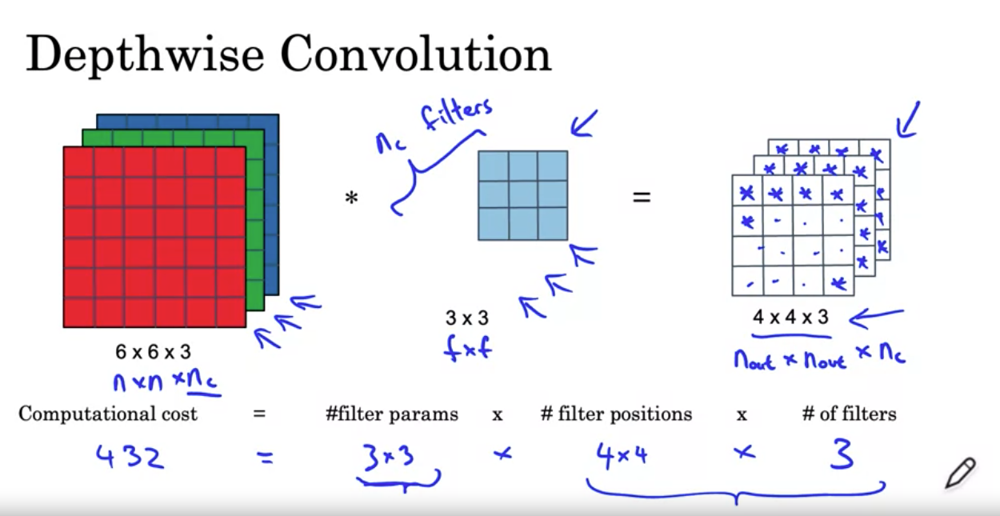

# Course 4: Convolutional Neural Networks (Week 2: Case Studies)
:star: Always learn from other case studies. Don't re-invent the wheel ! :star:
------------------------
## I. Classic Networks
### LeNet 5 (1998)
- Greyscale digit 
- Avg pooling with `s=2`. Max pool more common today 
- No padding. Valid convolutions. `s=1`. Sigmoid and tanh more common than ReLU at the time. 
- Channels # (`1->6 -> 16`)
- Softmax not used at output. Something else. 
- Small (`64K`). Today `10-100M` params. 
- Common: `conv->pool->conv->pool->fc->fc->output`

Not common today but in this:
- Nonlinearity after pooling (sigmoid)
- Filters don't have `n_c` channel each. Rather different filters for *each* channel. 

  

### AlexNet (2012)
- `60M` params (1000X size of LeNet)
- Deeper network
- ReLU act. 
- GPUs were slower at the time. 
- This paper convinced CV community that Deep Learning works for CV. 
- :star: Easier paper to read. :star:
- `Local Response Normalization (LRN)`:
  - Normalize activations across *all* (256) channels of a specific (`h,w`) in output volume. 
  - Why ? For each position in the `13x13` image, you don't want too many neurons with very high activation. 
  - Technique no longer used today as it's not very helpful. 


  
### VGG-16 (2015)
- 
- Relative uniformity in architecture:
  - Conv filters *always* `3x3, s=1, SAME`. 
  - Max pool layers *always* `2x2,s=2`. Halves the height and width. 
  - Rate of decrease of `n_h,n_w` is similar to Rate of increase in filters (`64 twice-> MP ->128 twice -> MP -> 256 thrice -> MP -> 512 thrice -> MP -> 512 thrice -> MP -> FC(4096) -> FC`).
  - Andrew Ng likes this pattern (doubling and halving rates systematic.) Why ???
- :star: New for me: `conv->conv->pool` Why multiple convs before each pool ?
  - `224x224x3 -> 224x224x64 -> 224x224x64 -> Max Pool` (2 successive SAME conv layers)
- `138M` params. Large even by today standards. 
- VGG-19 even bigger than this. VGG-16 performs similarly to this. So ppl use VGG-16. 


Ease of reading papers: Alex -> VGG -> Le
----------------------------

## II. ResNets (2015)
- Deep Neural Networks are hard to train due to vanishing and exploding gradients. 
- Res = Residual Networks
- Skip connections help with this problem. Combine `a^l` with linear sum of `a^[l+1]` *before* ReLU of `l+1`.
- Stacking of many such layers `l, l+1` with skip connection (residual blocks) to form deep NN


- Can help with vanishing gradient even if very deep (1000 layers+). But in practice only ~100 odd layers seen. 
- Theory: Very deep neural networks can overfit training set. Reality: Training error goes up with number of layers. Why ?:
  - Optimization algorithms struggle to train deep NN due to vanishing gradients. 


### Intuition: Why ResNets work well ?
- Deeper networks => vanishing gradients => performance on training set deteriorates.
:star: How do residual networks prevent vanishing gradient ? :star: 


- a<sup>[l]</sup> is ReLU output. So only positive values. 
- If L2 regularization makes W<sup>[l+2]</sup> and b<sup>[l+2]</sup> tend to 0 then 
a<sup>[l+2]</sup> = g(a<sup>[l]</sup>)
- g(a<sup>[l]</sup>) = a<sup>[l]</sup> (since g is ReLU and ReLU on relu output = output)
- So ResNet pretty good at learning identity functions when weights decay. 
- As good as not having layers `l+1` and `l+2`
 
:star: How does the math work out ?
- We're assuming z<sup>[l+2]</sup> and a<sup>[l]</sup> have same dimensions
#### Option 1: Same Convolution
- To implement this Resnet skip connection, ensure *same* convolution. Can preserve shape across layers.
#### Option 2: Multiply by a learnable weights W


- To make a<sup>[l]</sup> same dimensions as z<sup>[l+2]</sup> multiply by W<sup>s</sup> which can be:
  - Learnable matrix of parameters. R<sup>256x128</sup> OR
- Or use zero padding to make a<sup>[l]</sup> 256 dimensional

## III. 1 x 1 Convolutions
- Captures information along 1 pixel slice across all channels in input image. 
- Way to reduce number of channels while keeping n<sup>[l]</sup><sub>h</sub> = n<sup>[l+1]</sup><sub>h</sub> and
n<sup>[l]</sup><sub>w</sub> = n<sup>[l+1]</sup><sub>w</sub>.  Just use number of filters < number of input channels.
- :star: Pooling layers just used to shrink n<sub>w</sub> and n<sub>h</sub> while keeping channels fixed. :star: 

```
Keep h and w fixed, reduce channels => 1x1 Convolution
Reduce h and w, keep channels fixed ==> Max pool
```
- If you want to keep n<sub>c</sub> the same, 1x1 conv just adds *non-linearity* to input. 

## IV. Inception Network
_Szegedy 2014: Going Deeper With Convolutions_
- Way to learn what network architecture is best.
- Connect all options (conv_pool, just pool, just conv) in parallel in an inception block. Stack outputs. 
  - Since outputs h,w need to match input (for stacking)m=, use same padding, stride =1 for maxpool too 

### Computation Cost 
:star: Key Idea: 1x1 conv and bottleneck reduces number of mathematical operations by 1/10 :star:

#### Traditional Convolution Cost

- Note: number of additions ~ Number of additions in each case. So skipped since ratios remain same. 

- In traditional conv, above comp cost is 
```
Total number of output cells = 28 * 28 * 32
Multiplication operations for each cell = 5 * 5 * 192
Total Operations = 28 * 28 * 32 * 5 * 5 * 192 ~120M
```

#### Using 1*1 Conv and Bottleneck to get same output dim


```
To move from 28x28x192 -> 28x28x32

Step 1: 1x1 convolution (shrink down with 16 filters)
Total operations = Total output cells * Operations to get each cell value
Total operations = 28x28x16           * 192 ~ 2.4M

Step 2: Regular Convolution (enlarge with 32 filters)
Total operations = 28x28x32 * 5x5x16 ~ 10M

Total operations = 12M
```

- Does shrinking with 1x1 convolution and bottleneck hurt nn performance due to info loss ?
- _No: As long as bottleck is "reasonable"_
**TODO: What dat mean ?** 

### Inception Module


- In above module, we evaluate 4 possible paths for  prior activation:
  - Direct Maxpool (s=1 and same convolution)
  - Single 1x1 convolution
  - 1x1 (96 filters) -> 3 x 3 (128 filters)
  - 1x1 (16 filters) -> 5x5 (32 filters)
- Module ends with stacking outputs of all into 28x28x(sum of all filters) tensor


- Network = Stack of inception modules
- Side branches = Pass each hidden layer into softmax layer. Tells *how many such module stacks* needed to get 
the best performance.
  - Has regularizing effect on inception network. Hidden layers forced to learn robust features. 
- Above network = GooLenet (Homage by Google to LeNet. )

- Inception Name = "we need to go deeper" meme from inception (referred in paper)
- Inception module + Skip connections works well. 

## V. Mobile Network
- Works in low-compute (memory) envs like mobile phones. 
- :star: Key Idea: _Normal Conv v/s Depthwise-separabale conv_ :star:
- In both case using same input we want output of same size (`4x4x5`). The way that's achieved is diff.


### Depthwise Separable Conv
- Depthwise: :star: As many filters as input channels. 1 filter applied on 1 channel.  :star:


### Pointwise Conv
- Multiple n<sub>c</sub><sup>'</sup> 1x1 filters. 
- Each filter applies to all channels of input. (Not depthwise separable)


### Comparing Computational Costs


- Depthwise separable convolution ~ `1/10` 

```
Depthwise = Operations only all cells of 1 input channel only.
Pointwise = Operations across channels on 1 cell.
```

- Therefore replace expensive normal conv with depthwise-separable convolution

### MobileNet v1
- Depthwise separable module repeated `13` times. Ends with pool, FC and softmax


### MobileNet v2
- New `bottleneck` module with 2 main changes:
  - Addition of `Residual connection`:
    - Like skip connection. Solves vanishing gradient
  - `Expansion -> Depthwise -> Projection (same as pointwise)`
- Above module repeats 17 times -> Pool -> FC -> Softmax
- `Expansion`:
  - 1x1 normal convolution with more filters than input channels (hence expansion)
  - n<sub>c'</sub> ~ 6 * n<sub>c</sub>
- `Depthwise`:
  - Same convolution. No shrinking with depthwise. 
- `Projection`
  - Pointwise with fewer filters reduces tensor shape. 

- Why is bottleneck needed ?
  - Expansion: Increases size of representation within bottlneck. NN learns richer representation. 
  - Pointwise/Projection: Reducing size. Amount of memory needed to pass info from layer to layer is kept fixed / capped. 

## VI. EfficientNet
- How to *fine tune * mobile net for different edge devices.
  - Some phones with more memory you can get more accuracy with high speed
  - Phones wiht lower memory, you can choose speed over accuracy.
- Way to select ratios of r,d and h 


# Week 2: Practical Advice on Conv Nets
------------------------
## Using Open Source Implementations
- Download someone's pre-trained model reuse. 

## Transfer Learning

- When to freeze/add new layers on frozen layers
  - Most data => Train all layers, using downloaded weights as initialization.
  - More data => Freeze fewer layers, add more layers on top. 
  - Less data => Freeze more layers. Just train `softmax` layer
- For a lot of CV applications:
  - So much data available and training done already. :star: *Almost always using a pre-trained network better than 
  training from scratch* :star:
  - Only time worth doing from scratch -> extremely (?) large dataset yourself. 
  


## Data Augmentation
- Mirroring
- Random Cropping 
- Less commonly used: Rotation, Shearing, Local Warping

- Color Shifting (change R,G,B channels)
  - Accounts for changes in illumination
  - `PCA Color Augmentation` (details in AlexNet paper): If your image has high RB low G, it will reduce RB and increase G.

- Implementing Distortions:
  - Can run in parallel to training. Each mini-batch selected and distorted by a thread.


## State of CV
- Lots of data but not lots of relevant data. So more time spent on hand-engineering features,
network architecture design etc. 


### Tips for doing well on benchmarks (not production)
- Better odds of paper being accepted if it's on benchmark. Helps community. 
- Ensembling wins competitions but not used in production due to budgets. 
- Multicrop: Take edge crops of each image (mirrored and unmirrored)


### Use Open Source Code!
- Architectures on leaderboards and papers
- Don't re-impl architecture. Use open-source impls
- Use pretrained models and fine-tune on dataset (transfer)
