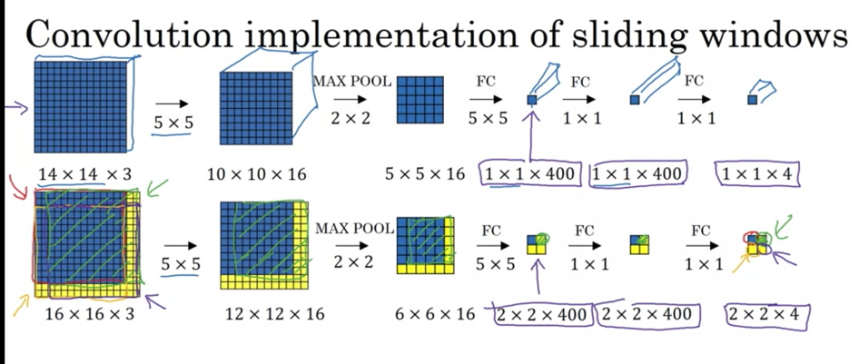
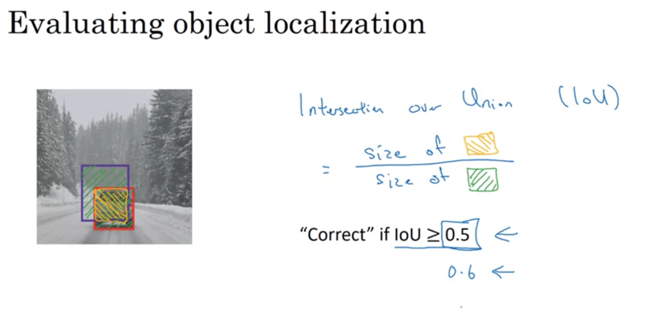
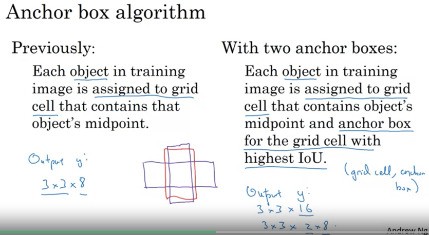
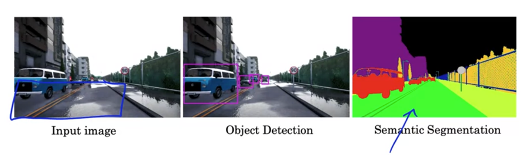
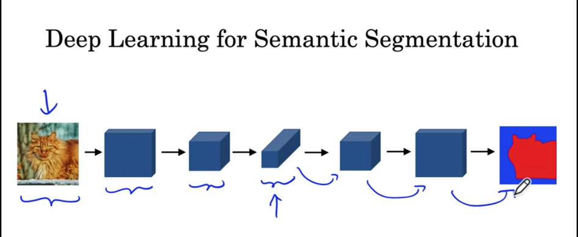
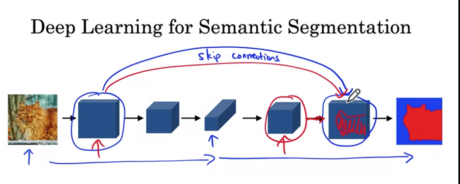
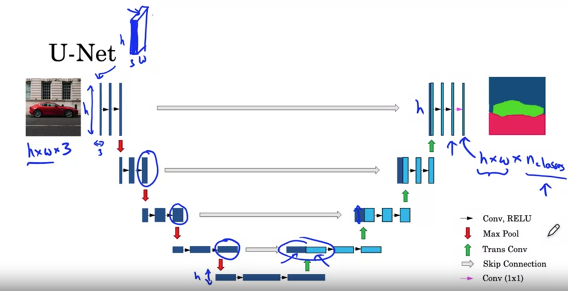

# Week 3: Detection Algorithms
- Object Detection (draw bounding box) (YOLO Algo)
- Segmentation (Label each pixel) (U-Net Algo)

## Detection
### Object Localization
_Define bounding box of an object_
Output vector for 3-way classification has:
- pc : is object in image or not = (0,1)
- bx : centre x coordinate of object
- by : centre y coordinate of object
- bh : height of object: Fraction of overall height of image
- bw : width of object: Fraction of overall width of image
- c1 : one-hot encoded class label
- c2 : one-hot encoded class label
- c3 : one-hot encoded class label

### Landmark Detection
_Find coordinates of relevant landmarks_
- Detecting landmarks on face: Snapchat AR filters. Draw crown. 
- You need images with labels. Laborious annotation of landmarks. 
- Identity of each landmark must be consistent across all images:
  - Landmark1 = Left corner of left eye.
- Applications:
  - Pose of a person
  - Emotion of a person

### Object Detection: Sliding Window Algorithm
_Sliding Windows Detection_
- Page 10
- Pass different windows of an image through ConvNet. 
- Cons:
  - High computational cost. 

_Convolutional Sliding Window_
OverFeat 2014 paper. 
- Instead of running forward prop for each subset of image separately. 
- Helps share computations across shared areas between diff subets of regions. 
- Replace sequential passing each window through a convNet with doing all windows together

### Bounding box predictions : YOLO Algorithm
- Above techniques don't predict accurate bounding box
  - Bounding box may not be sliding window size. Maybe rectangle. 
- Solution: You Only Look Once Algorithm (2015, Redmon et. al)

### Intersection over Union
- How to measure accuracy of localization:

- IoU = overlap between 2 bounding boxes. Intersection between 2 boxes / Union area. 

### Non-max Suppression
- Problem with object detection:
  - There are only say 2 objects in image
  - But Multiple cells in output may have pc > 0.5.
- NMS detects once per object rather than multiple detections per car. 
  - Discard all boxes with pc > < threshold
  - While there are any remaining boxes:
    - Pick the box with the largest pc. Output that as a prediction. 
    - Discard any remaining box with IoU ≥ 0.5 with the box output from prev step. 
  - Instead of while loop: Carry it out as many times as there are output classes. (details in programming exercise)

### Anchor Boxes
- Each grid cell can only detect 1 object. What if there is more than 1 object ? Anchor boxes

- Solution: Anchor boxes. _Predefine_ shapes of objects expected in images. 
  - Use _K-means clustering_ to find best anchor boxes for your dataset. 
- Anchor boxes allow for detection of multiple objects in 1 grid cell. 
- **Caveats**:
  - Multiple objects with _same_ anchor box shape in same grid cell ? 
    - Use some tie-breaking rules. Rare in practice. 
    - Algo only allows 1 object of 1 anchor box shape to be predicted per grid cell. 
  - How to reduce odds of multiple objects in same grid cell ?
    - Use `19*19` grid instead of `3*3` grid. Reducing size of a grid cell helps 
  - Anchor box helps learning algo _specialize_ better:
    - Same output units can detect tall skinny objects: pedestrians
    - Some can detect wide objects: cars. 
- **Math** :Say 
  - image is broken up into `19*19` grids. 
  - 2 anchor boxes.
  - 3 objects in image: car, pedestrian, motocycle
  - So each grid cell has 2 output vectors, one per anchor box, each with 8 values:
    - 1 pc
    - 4 bounding box coordinates
    - 3 booleans for 3 classes
  - So output size : `19 * 19 * 2 * 8`

### YOLO Algorithm:
- **Constructing Training Set**
  - Need `grid_cell_count * # of anchors * (1 + 4 + nc)` shape label for each training set. 
- For test set, get outputs
- Run non-max suppression. 
  - Get 2 predicted bounding boxes for each cell. (Some bounding boxes can go _outside_ grid cell)
  - Get rid of low probability predictions. 
  - For each class, run non-max suppression to generate final predictions. 

## Region Proposal Algorithms
- `R-CNN: Regions CNN`: Picks regions in pic where its worth to run CNN. 
  - 2013 Girshik et. all
  - Selecting regions using segmentation.
  - Classify regions one at a time. 
  - Output: Label and bounding-box per region (It doesn't trust the bounding box it was given)
  - Problem: Slow
- `Fast R-CNN`:
- 2015 Girshik
  - Convolutional implementation of sliding windows. Similar to above concept. 
  - Problem: 
    - Region selection is slow. 
- `Faster R-CNN`:
  - Ren et.al 2016
  - Use CNN to _propose_ regions. 
- Ng prefers one algo to do it all (Yolo) over a 2 step algo (region proposal then object detection). But opinions differ

## Semantic Segmentation
- SS: Rather than detecting objects, _label every single pixel_. 
  - SS used by self-driving. Which pixels are safe to drive over.
  - Segment out tumor from brain scan

- Architecture: 

  - How to grow output tensor size from a smaller tensor : **Transpose Convolutions**

### Transpose Convolutions
:star: Very new to me :star:

- Use a filter _larger_ than input. Then pad output. 
- Place _filter_ on _output_ than input for convolution.
- Many ways to grow a tensor like TC. 

### U-Net Intuition
(2015, started out for biomedical applications)

In the encoder: Tensors become smaller but deeper. Reverse in decoder.  

- Encoder-Decoder.
  - Encoder: Captures context
  - Decoder: Allows precise localization
- Skip Connections:
  - Connecting encoder layer with corres. decoding layer. Combiner:
    - Lower resolution, high-level spatial / contextual info from penultimate layers (decoder)
    - Higher resolution spatial resolution & low-level features :from lower layers. 

  - Note the skip connection between each mirror layer. It's not just between first and last layers !

